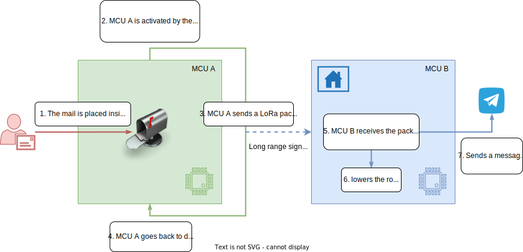
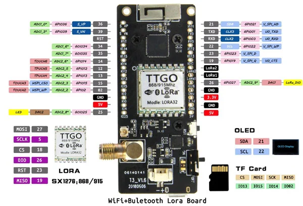
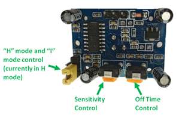
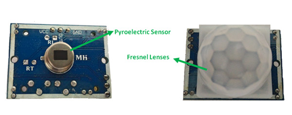
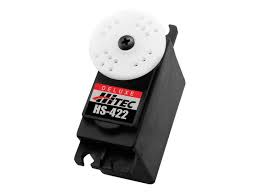
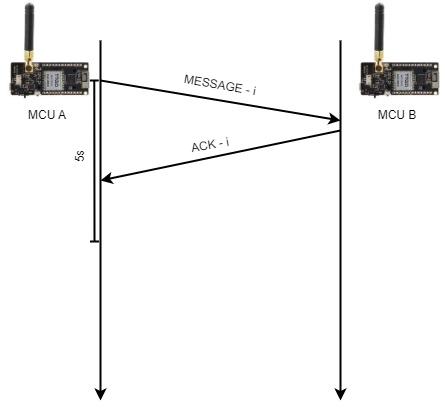
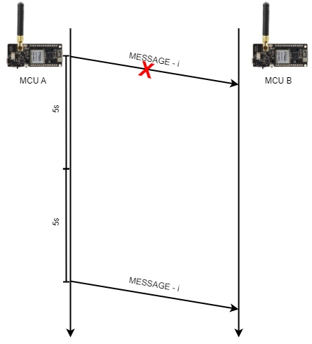
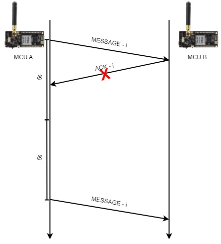

   <h1>Automated Mailbox Notifier  </h1>

Internet of Things course project - UniCT 2022/23

<blockquote>
  
"With AMN, you'll never miss a mail delivery again!"

</blockquote>

------

- **[Introduction](#Introduction)**
  - **[MCU A](#MCU-A)**
  - **[MCU B](#MCU-B)**

- **[Hardware](#Hardware)**
  - **[MCUs used in the project](#MCUs-used-in-the-project)**
  - **[PIR Sensor](#PIR-Sensor)**
  - **[Servo motor](#Servo-motor)**
  
- **[Handling packet loss](#Handling-packet-loss)**
- **[Authors](#Authors)**

------

## Introduction

AMN is a project designed to automatically notify the user when a mail is delivered to the mailbox. The project consists of two microcontroller units (MCUs): `MCU A` and `MCU B`.

### MCU A

`MCU A` is placed inside the mailbox along with a PIR sensor. The PIR sensor detects the motion of a mail being inserted into the mailbox, which then wakes up `MCU A` from its sleep state.

Once awake, `MCU A` sends a LoRa packet to `MCU B` which is located inside the user's home. After sending the packet, `MCU A` returns to its deep sleep state.

### MCU B

`MCU B` receives the LoRa packet sent by `MCU A` and performs two actions:

1. Lowers a toy robotic arm.
2. Sends a message to a Telegram channel, alerting the user of the new mail.

## Hardware

+ Two microcontroller units (MCUs) were used in the project, each equipped with a LoRa module. The LoRa module allowed for the communication between the two MCUs, enabling the transmission of the mail notification from the mailbox to the user's home.
+ A PIR (Passive Infrared) sensor was used to detect the motion of the mail being inserted into the mailbox. The sensor wakes up the first MCU (`MCU A`) from its sleep state when it detects the motion.
+ A servo motor was used to lower a toy robotic arm, which serves as a visual indication of a new mail delivery. The second MCU (`MCU B`) controls the servo motor and lowers the arm in response to the received LoRa packet.

### MCUs used in the project

In the AMN (Automated Mailbox Notifier) project, two TTGO OLED LoRa boards were used.

The board is based on the ESP32 Wi-Fi module and the 868 MHz LoRa™ SX1276 module. It also has a 32 MB flash memory, a metal Wi-Fi antenna soldered directly to the PCB, a LoRa™ antenna socket (included), a 0.96" OLED display, a lithium polymer battery charger, a micro USB connector, a CP2102 USB-serial converter, a micro SD card slot, and 2 status LEDs.

    

The characteristics of the TTGO OLED LoRa board are the following:

+ **Processor**: Xtensa 32-Bit LX6 Dual Core
+ **Clock**: from 80 to 240 MHz (adjustable)
+ **ROM memory**: 448 KB
+ **SRAM memory**: 520 Kb
+ **External flash memory**: 32 MB
+ **Interfaces**: SD, UART (3 channels), SPI (3 channels), SDIO, I2C (2 channels), I2S (2 channels), IR LED PWM (2 channels), and PWM motor (3 channels);
+ **GPIO types**: digital IO (36), 12-bit ADC (16 channels), 8-bit DAC (2 channels), capacitive sensor (10 channels); LNA preamplifier;
+ **WiFi**: 802.11 b / g / n: 2.4 to 2.5 GHz
  + **Data transmission speed**: 150 Mbps @ 11n HT40., 72 Mbps @ 11n HT20, 54 Mbps @ 11g, 11 Mbps @ 11b;
  + **Wi-Fi transmission power**: 19.5dBm @ 11b, 16.5 dBm @ 11g, 15.5 dBm @ 11n;
  + **Wi-Fi receive sensitivity**: up to -98dBm
  + **WiFi security**: WPA / WPA2 / WPA2-Enterprise / WPS;
  + **WiFi cryptography**: AES / RSA / ECC / SHA;
+ **Bluetooth**: 4.2 BR / EDR and BLE (Bluetooth Low Energy);
+ **OLED display**:
0.96" blue with SSD1306 graphics controller;
+ **LoRa™**:
  + **Frequency**: 868 MHz;
  + **Modulation mode**: FSK, GFSK, MSK, GMSK, LoRa TM, OOK;
  + **Receive sensitivity**: -139dBm;
+ **Power supply**: from 3.3 V to 7 V;
+ **Operating temperature**: from -40℃ to +85℃.

### PIR sensor

The PIR (Passive Infrared) Sensor Module is a device that can detect motion and trigger an output signal. It can be powered with a voltage between 4.5V and 20V, but typically 5V is used. After powering the module, it takes a few minutes to calibrate itself.

There are two operating modes in the PIR Sensor Module: Repeatable(H) mode and Non-Repeatable(L) mode. Repeatable mode is the default mode. The output of the sensor can be set by shorting two pins on the left side of the module, and two orange potentiometers can be used to adjust sensitivity and time.

    

#### Repeatable(H) mode

In Repeatable(H) mode, the output pin goes `high` when an object is detected within range and returns to `low` after a set amount of time (determined by the "Off time control" potentiometer). The output pin goes `high` regardless of whether the object is still present. The sensitivity can be adjusted with the "sensitivity control" potentiometer.

 

#### Non-Repeatable(L) mode

In Non-Repeatable(L) mode the output pin will go `high` when an object is detected within range and will stay `high` as long as the object stays within the limit of the sensor range. Once the object has left the area the pin will go `low` after the particular time which can be set using the potentiometer. The sensitivity can be set using the “sensitivity control” potentiometer.

#### Materials

There are two important materials in the sensor: one is the **pyroelectric crystal**, which can detect movements; the other is a **Fresnel lenses**, which can widen the range of the sensor.

    

### Servo Motor

A servo motor is a self-contained electrical device, that rotate parts of a machine with high efficiency and with great precision.

    

## Handling packet loss

**Case 1**: the communication goes well.

+ `MCU A ` sends a notification packet with a sequence number $n$;
+ `MCU B` receives the notification and sends an ack with sequence number $n$;
+ `MCU A` receives the ack and goes to sleep.

    

**Case 2**: `MCU B` doesn't receive the notification.

+ `MCU A ` sends a notification packet with a sequence number $n$;
+ `MCU B` receives nothing;
+ `MCU A` waits for the ack for $5s$;
+ `MCU A` asserts a flag to send the notification again;
+ `MCU A` goes to deep sleep for $5s$ and retries to notify.

    

**Case 3:** `MCU A` doesn't receive the ack.

+ `MCU A ` sends a notification packet with a sequence number $n$;
+ `MCU B` receives the notification and sends an ack with sequence number $n$;
+ `MCU A` receives nothing and proceeds as described in **Case 2**;
+ `MCU B` receives the notification with sequence number $n$ again, doens't notify the old message but only replies with an ack;
+ `MCU A` and `MCU B` automatically sync when restarted.

    

## Demo

    

## Authors

<a href="https://github.com/LemuelPuglisi" target="_blank"> Lemuel Puglisi</a> 
<a href="https://github.com/FrancescaRagazzi" target="_blank"> Francesca Ragazzi</a> 
<a href="https://github.com/LoZioo" target="_blank"> Davide Scalisi</a> 
<a href="https://github.com/Gigi-G" target="_blank"> Luigi Seminara</a> 

